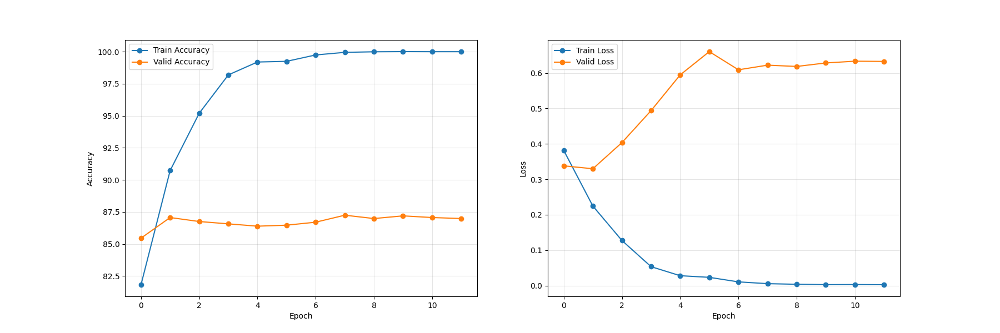
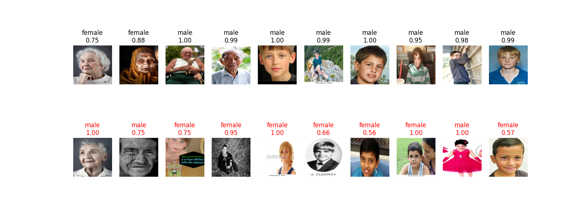
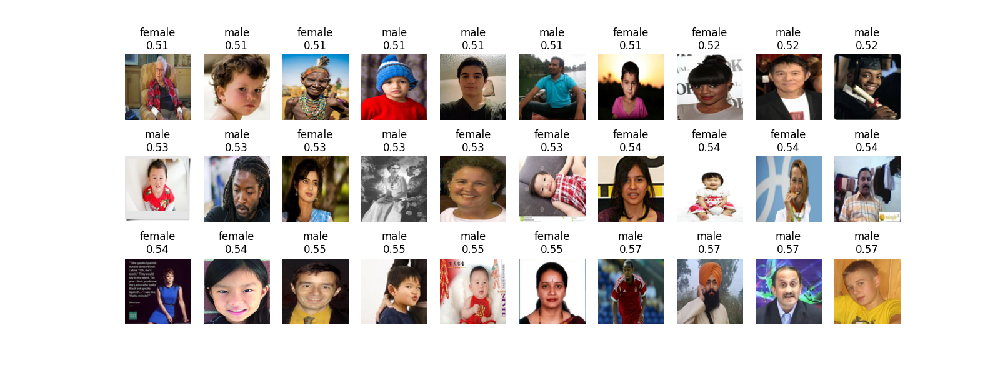
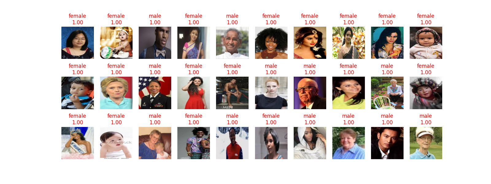

# FacialGenderNet
[UTKFace](https://susanqq.github.io/UTKFace/)のデータセットを使用し男女の顔判別AIアプリの作成を目的とする。 
モデルは[MobileNetV2](https://arxiv.org/pdf/1801.04381.pdf)を2値分類用に最終層を変更したものを使用
## Results
#### Actualy and Loss

Trainin結果は上記のようになった事前学習モデルを使用したので最初から精度がいいのはうなずけるが、validationの正解率やLossが上がらなかったのが残念。  

#### Correct and incorrect data

正解データと不正解データの例。黒字が正解データで赤字が不正解データ。またその各画像の数値が予測確立を表している
  

#### Low probability correct image

低確率正解データの例。
  

#### Highly probable incorrect image

高確率正解データの例。
 

#### consideration
画像サイズが100*100の中でまあまあ良く判定できているとは思う。実際不正解画像の中にも人間でも間違ってしまうような画像や、明らかに正解ラベルが違うのもある。今回実装がメインなので、今後アクティブラーニングで精度を上げたり年齢の判定も行えるようなものを作りたい。
## Usage

### Prerequisites
本アプリは以下の **./docker** 環境に準ずるものとする。以下に本アプリのdockerの環境構築手順を記す
1. dockerのイメージのbuild
    >sh ./docker/build.sh
2. dockerのコンテナの起動
    >sh ./docker/into.sh
### Data Preparation
1. [URL](https://susanqq.github.io/UTKFace/) から **UTKFace** データセットの画像ファイルのzipデータをダウンロードして、zipデータのまま **./dataset** のフォルダに配置する。
2. 以下のコマンドを実行し、データセットを分割する
    > sh spilit_dataset.sh

### Evaluation
**./Result**フォルダから学習済み重みファイル(pth)を選択し推論をする。以下のコマンドを実行。 
> sh run_evaluation.sh
### Training
以下のコマンドを実行し、学習を開始する。学習の条件はshファイルで変更できる。以下のコマンドを実行。 
> sh run_train.sh
## References
- [MobileNetV2論文](./assets/training_results.png) 
- [UTKFaceデータセット](https://susanqq.github.io/UTKFace/)
- [参考URL](https://qiita.com/ha9kberry/items/ae0eabc50a3974c2d92e)